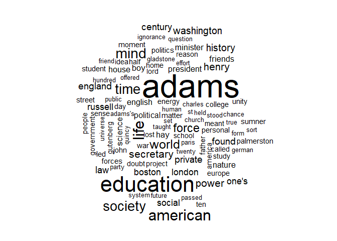
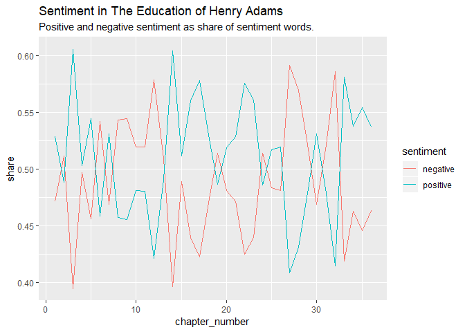
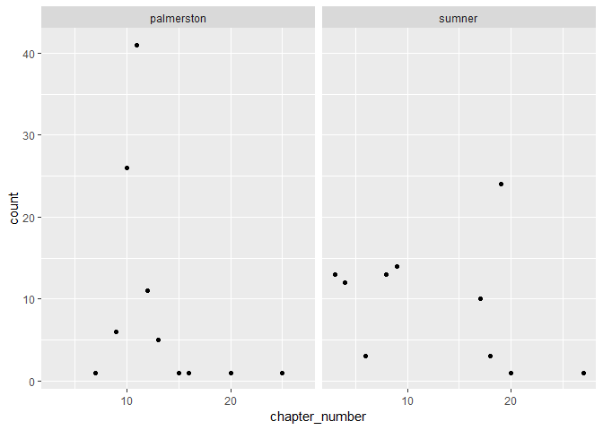
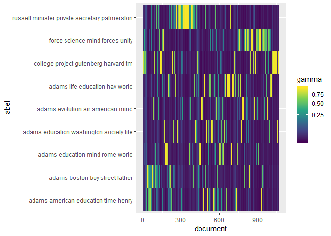
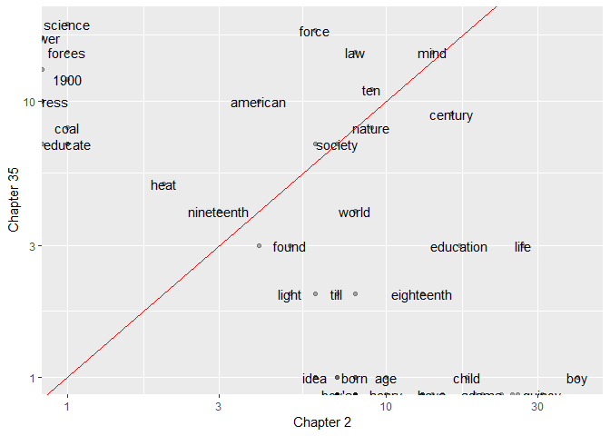
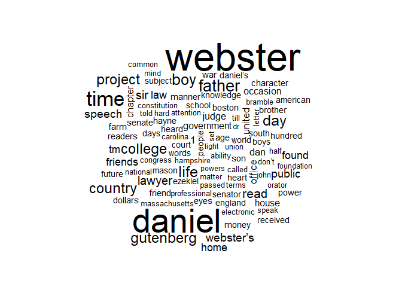
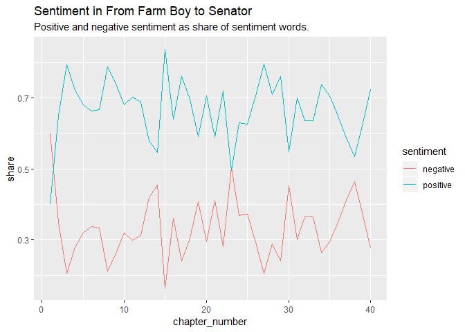
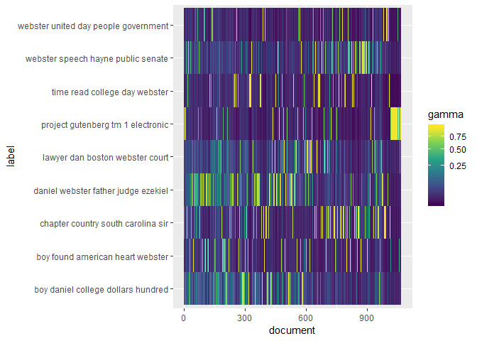

Not Reading a Boston Biography
================
Erica Yee
March 18, 2019

The purpose of this assignment was to “read” two books distantly through
textual analysis.

# Predictions

I chose *The Education of Henry Adams by Henry Adams*. Based on reading
the first two chapters on Adams’ childhood, I think the restwill further
explore how his “education” was not from traditional schooling or
religion but more experiential-based. Adams discusses his grandfather
John Quincy Adams and father Charles Francis Adams, both important
political figures in American history who were likely influential in
Adams’ worldview and thus prominent throughout the text. Boston,
specifically the political epicenter of State Street, will may continue
to be a significant setting. Based on the time and setting when Adams
lived, as well as his natural curiosity and thoughtfulness, I expect
Adams to also discuss technologial advances of the time. This prediction
is corroborated by the table of contents (i.e., Ch. 15 Darwinism, Ch. 31
The Grammar of Science). As an adult writing about his childhood, Adams
uses third-person past-tense for the first two chapters. I expect this
point-of-view to stay consistent.

# Setup

``` r
library(tidyverse)
library(tidytext)
library(stm)
library(wordcloud)
```

# Generate wordcloud

``` r
adams = tibble(paragraph = read_file("data/adams_fulltext.txt"))

adams %>% 
  unnest_tokens(word,paragraph) %>%
  group_by(word) %>% summarize(count = n()) %>%
  anti_join(stop_words) %>%
  with(wordcloud(word, count, max.words = 100))
```

<!-- -->

Unsurprisingly, the most common words by far are “Adams” and
“education.” Though “Henry” occurs relatively frequently compared to
all the other words, it is much smaller in the wordcloud than “Adams.”
It makes sense that “Adams” appears the most, given the number and
frequency the author mentions members of his family. Other spotted names
include “John,” “Sumner,” “Russell,” “Palmerston,” “Gladstone.” “John”
could refer to a number of men in his circles. “Sumner” likely refers to
Charles Sumner, a U.S. senator from Massachusetts who left the Whigs to
join the Free Soil Party along with Adams’ father. A quick internet
search reveals that the last three names refer to British politicians
whose perspectives may have influenced Adams’ education. “Washington”
also appears quite frequently, though probably usually referring to the
capital rather than the president due to the timing of the book. Other
prominent locations are “Boston” and “England.”

# Compare word frequencies

``` r
adams_words <- adams %>% 
  unnest_tokens(word,paragraph) %>%
  group_by(word) %>%
  summarize(count = n()) %>%
  arrange(-count)

adams_words_nostop <- adams %>% 
  unnest_tokens(word,paragraph) %>%
  group_by(word) %>%
  anti_join(stop_words) %>%
  summarize(count = n()) %>%
  arrange(-count)
  
adams_words
```

    ## # A tibble: 12,701 x 2
    ##    word  count
    ##    <chr> <int>
    ##  1 the   11428
    ##  2 of     6739
    ##  3 and    5257
    ##  4 to     5100
    ##  5 in     3662
    ##  6 a      3597
    ##  7 he     3433
    ##  8 was    3116
    ##  9 his    2337
    ## 10 as     2258
    ## # ... with 12,691 more rows

``` r
adams_words_nostop
```

    ## # A tibble: 12,126 x 2
    ##    word      count
    ##    <chr>     <int>
    ##  1 adams       808
    ##  2 education   498
    ##  3 american    327
    ##  4 life        322
    ##  5 mind        290
    ##  6 society     274
    ##  7 time        270
    ##  8 world       243
    ##  9 force       229
    ## 10 secretary   188
    ## # ... with 12,116 more rows

The first non-stopword, “Adams,” is the 26th most common word with 808
occurrences; “education” the 43rd with 498. I was interested in pronoun
counts, and noticed that relative frequency of male pronouns – he
(3433), his (2337) him (789), himself (456) – far outpaces collective
ones – they (762), their (513), them (366), theirs (9) – and even more
so female ones – her (210), she (157), herself (29), hers (2). Thus
Adams likely talks minimally about women in his life.

Something I found somewhat surprising was how words that seem prominent
in the wordcloud appear relatively very low in the frequency table. For
example, the word “secretary” jumps out to me from the wordcloud as one
of the most common words excluding stop words. By visual assessment, it
looks to come only after “Adams,” “education,” “life,” “american,”
“society,” “time,” and “mind.” Yet in the frequency table I see it’s
only the 105th most common word with 188 occurrences. This ranking
probably speaks to how many stop words are excluded in order to more
clearly see significant words.

When looking up exact word counts for the names visible in the word
cloud, I saw that “Palmerston” and “Sumner” both show up 94 times. I
would’ve guessed that Sumner appeared more due to his proximity and
influence in the Bostonian politics and society Adams was surrounded by,
at least in his early life. Palmerston, whom I look up, was UK prime
minister when Adams was a young man. His views and policies must have
been a significant factor in Adams’ education to warrant so many
mentions.

Lastly, I was surprised by the number of words which appear exactly once
in the book: 5,306 to be exact. Many seem like they could have easily
been more common, including “wouldn’t,” “unofficial,” “shift,” and
“intend.”

# Explore ngrams

``` r
adams_bigrams <- adams %>%
  unnest_tokens(word,paragraph,token="ngrams",n=2) %>%
  group_by(word) %>% summarize(count = n()) %>%
  arrange(-count)

adams_bigrams
```

    ## # A tibble: 90,731 x 2
    ##    word    count
    ##    <chr>   <int>
    ##  1 of the   1192
    ##  2 in the    881
    ##  3 to the    504
    ##  4 he had    469
    ##  5 and the   466
    ##  6 he was    424
    ##  7 to be     420
    ##  8 on the    363
    ##  9 of his    338
    ## 10 for the   315
    ## # ... with 90,721 more rows

Most of these 90,731 total pairs seem to be expected connective ones,
such as the most common “of the” (1192) and “in the” (881). With the
high counts of male pronouns looked at previously in mind, I noticed
some of the most common pairs include these pronouns: “he had” (4th,
469), “he was” (6th, 424), “of his” (9th, 338), “he could” (12th, 297).
It makes sense for a biography to have so many of these phrases.

The two most common phrases that are not just stop words and pronouns
are “the American” (50th, 117) and “private secretary” (\#52, 114). I’m
not sure what these refer to without context. In the former, “American”
is likely more as an adjective than a noun. I wonder if Adams worked as
a private secretary, and if so, to whom. The [Google Books Ngram
Viewer](https://books.google.com/ngrams) for the phrase “the American”
has several sudden peaks over the years, including around 1850 and 1865,
then not again during Adams’ lifetime. The final major peak occurs
around 1965.

The phrase “private secretary,” on the other hand, overall increases in
frequency until 1920 – just after *Education* was published. I compared
this phrase to “personal assistant,” which is how I understand the role
and would refer to it today. Interestingly, this phrase barely shows up
in the Google Books database until it slowly increases beginning in
1910.

The first name to appear in this list is unsurprisingly “Henry Adams”
(55th, 108). I looked up “Palmerston” since he showed up so often in the
previous list: “Lord Palmerston” is the most frequent phrase witih 18
occurrences. Interestingly, “Lady Palmerston” shows up seven times. I
wonder what Adams knew of her. The name “Palmerston” starts appearing in
the Google Books database just before 1840, peaking around 1860 and then
dramatically almost disappearing by 1920 before peaking again around
1935.

``` r
adams_trigrams <- adams %>%
  unnest_tokens(word,paragraph,token="ngrams",n=3) %>%
  group_by(word) %>% summarize(count = n()) %>%
  arrange(-count)

adams_trigrams
```

    ## # A tibble: 156,647 x 2
    ##    word                  count
    ##    <chr>                 <int>
    ##  1 he could not             94
    ##  2 the private secretary    64
    ##  3 as far as                60
    ##  4 as well as               57
    ##  5 one of the               57
    ##  6 project gutenberg tm     56
    ##  7 would have been          48
    ##  8 he would have            46
    ##  9 more or less             45
    ## 10 of his own               45
    ## # ... with 156,637 more rows

A few trigrams of interest: “the private secretary” (2nd, 64) & “a
private secretary” (44th, 25), “the eighteenth century (37th, 27),”the
United States" (38th, 27), “Charles Francis Adams” (123rd, 15). In the
Ngram Viewer, the phrase “the eighteenth century” increases to a peak
from 1930 to 1940 before decreasing and leveling off since 1985.

The appearance of the name of Charles Francis Adams in this list makes
me think about how the simplest way to determine characters in a book
via distant reading is by looking at the frequencies of individual
words. In narrative writing, from fiction to news articles, characters
are usually referred to by only their first or last names upon second or
later reference, which nullifies much of the usefulness of bigrams here.
A text containing multiple family generations complicates this; it makes
sense that “Adams” is the most common individual non-stop word in this
text. Henry Adams seems to usually refers to himself by his surname or
“the young man” or other descriptors. Thus it also follows that
“Charles Francis Adams” is the most frequent name trigram due to its
uniqueness and the author’s need to differentiate different members of
the Adams family.

The vast majority of commonly used words seem to be ones we still use
today. Looking at the frequency table of 2-word phrases in decreasing
order, the first I came across that I did not recognize was “the
legation” (47), which is apparently a diplomatic minister or the
position of one. I wonder if he served in the office of a diplomat. I
compared the words “legation,” “ambassador,” and “diplomat” because they
all refer to a similar type of office. These words appear in *Education*
to varying degrees. In the Ngram Viewer, “ambassador” had by far the
most occurrences, though its frequency decreased significantly since
1830. The word “diplomat” seemed to gain use beginning around 1860, and
it actually surpassed “legation” around 1910. The latter has since
decreased in use.

# Generate sentiment plots and topic models

``` r
adams_text = tibble(text = read_file("data/adams_fulltext.txt"))

chapters = adams_text %>% 
  unnest_tokens(chapter, text, token = "regex", pattern = "CHAPTER") %>%
  mutate(chapter_number = 1:n())

wordcounts  = chapters %>%
  unnest_tokens(word, chapter) %>%
  group_by(chapter_number, word) %>% 
  summarize(count=n())

bing = sentiments %>% filter(lexicon=="bing")

wordcounts %>% 
  inner_join(bing) %>%
  group_by(chapter_number, sentiment) %>%
  summarize(score = sum(count)) %>%
  group_by(chapter_number) %>% 
  mutate(share = score/sum(score)) %>%
  ggplot() + geom_line(aes(y=share, x = chapter_number, color=sentiment )) + 
  labs(title="Sentiment in The Education of Henry Adams", subtitle="Positive and negative sentiment as share of sentiment words.")
```

<!-- -->

Sentiment in *Education* appears to alternate between positive and
negative throughout the book, though it seems to both start and finish
relatively positively. I wonder what conclusions Adams came to about his
life and the world around him by the end of his life.

``` r
wordcounts %>% 
  filter(word=="sumner" | word=="palmerston") %>%
  ggplot() + geom_point(aes(x = chapter_number, y = count)) + facet_wrap(~word)
```

<!-- -->

Comparing frequency of two different names gives the impression that
Palmerston was a bigger influence in Adams’ early life, while Sumner
played a relatively larger part
later.

``` r
paragraphs = adams_text %>% unnest_tokens(chapter, text, token = "regex", pattern = "\r\n\r\n") %>%
  mutate(par_number = 1:n()) %>%
  unnest_tokens(word, chapter) %>%
  group_by(par_number, word) %>% 
  summarize(count=n())

topic_model = paragraphs %>%
  anti_join(stop_words) %>%
  cast_sparse(par_number, word, count) %>%
  stm(K = 9, init.type = "Spectral", verbose = FALSE, seed = 1) 

word_probabilities = topic_model %>% tidy(matrix="beta") %>%
  group_by(topic) %>% 
  arrange(-beta)

topic_labels = word_probabilities %>%
  filter(term!="â") %>%
  slice(1:5) %>%
  summarize(label = paste(term, collapse = " "))

document_probs = topic_model %>% tidy(matrix="gamma")

document_probs %>% inner_join(topic_labels) %>% ggplot() + geom_tile(aes(x=document, y = label, fill=gamma)) + scale_fill_viridis_c(trans="sqrt")
```

<!-- -->

From the computationally-derived topics, I can conjecture that Adams
likely worked as a private secretary in some capacity related to a
minister (maybe the British politician Russell?) when he was a young
adult. This topic has the highest concentration of words in the first
half of the book, but presumably after he was a boy. Another generated
topic based on words like “forces” and “science” clusters near the end
of the book, which makes sense given the timing further American
industrialization in Adams’ lifetime.

# Break it down

``` r
adams_text %>%
  unnest_tokens(chapter,text,"regex",pattern="CHAPTER ",to_lower = F) %>% 
  mutate(chapter_num = paste("Chapter", 1:n())) %>% #
  unnest_tokens(word,chapter,"words") %>%
  group_by(chapter_num,word) %>%
  anti_join(stop_words) %>%
  summarize(count=n()) %>% 
  spread(chapter_num,count,fill=0) %>%   
  filter(`Chapter 2` + `Chapter 35` > 6) %>% 
  ggplot() +
  aes(x=`Chapter 2`,y=`Chapter 35`,label=word) + 
  geom_point(alpha=.3) + 
  geom_text(check_overlap = TRUE) +
  scale_x_log10() +
  scale_y_log10() +
  geom_abline(color = "red")
```

    ## Warning: Transformation introduced infinite values in continuous x-axis

    ## Warning: Transformation introduced infinite values in continuous y-axis

    ## Warning: Transformation introduced infinite values in continuous x-axis

    ## Warning: Transformation introduced infinite values in continuous y-axis

<!-- -->

When comparing the second and final chapters, the words “boy,” “child,”
and “life” show up a lot more in the former. In the latter, he mentions
words like “forces/force,” “science,” “heat,”and “coal” relatively more.
I can guess from these comparative word frequencies that he talks more
about himself and childhood in the beginning before moving onto
discussing larger trends in society as an adult. The machinery-related
words corroborate the findings from the topic model that revealed a
related cluster near the end of the book. The words that appear around
the same number of times in these two chapters are “society,”nature,"
and “mind.” I can make an informed conjecture that Adams talks about how
he viewed the world around him at any given age more than the events
that occurred in his life.

# Compare and contrast

For the new book, I chose *From Farm Boy to Senator* (1882) by Horatio
Alger Jr., a juvenile biography on Massachusetts Senator Daniel Webster.
Adams references Webster frequently in the second chapter of his book
due to his prominence in Boston and contrasts with his father. The full
text was available in Project Gutenberg.

``` r
webster = tibble(paragraph = read_file("data/webster_fulltext.txt"))

webster %>% 
  unnest_tokens(word,paragraph) %>%
  group_by(word) %>% summarize(count = n()) %>%
  anti_join(stop_words) %>%
  with(wordcloud(word, count, max.words = 100))
```

<!-- -->

Though I have not read any of the Webster biography, I can still glean
information from the wordcloud based on the title and my limited
knowledge of his significance in American history. The word “boy” is
relatively prominent, so Alger likely spends time talking about
Webster’s childhood. Other frequent words are liekely related to his
education (“college”), profession (“lawyer,” “government,” “senate,”
“public,” “speech”), and location (“farm,” Boston," “Massachusetts”).
However, I don’t think I would be able to connect these words as well if
I didn’t have any background information on Webster.

``` r
webster_words <- webster %>% 
  unnest_tokens(word,paragraph) %>%
  group_by(word) %>%
  anti_join(stop_words) %>%
  summarize(count = n()) %>%
  arrange(-count)

webster_2gram <- webster %>%
  unnest_tokens(word,paragraph,token="ngrams",n=2) %>%
  group_by(word) %>% summarize(count = n()) %>%
  arrange(-count)

webster_words
```

    ## # A tibble: 6,645 x 2
    ##    word      count
    ##    <chr>     <int>
    ##  1 webster     299
    ##  2 daniel      255
    ##  3 time        142
    ##  4 father      103
    ##  5 boy          95
    ##  6 day          92
    ##  7 life         92
    ##  8 project      88
    ##  9 gutenberg    87
    ## 10 college      84
    ## # ... with 6,635 more rows

``` r
webster_2gram
```

    ## # A tibble: 38,014 x 2
    ##    word       count
    ##    <chr>      <int>
    ##  1 of the       479
    ##  2 in the       314
    ##  3 to the       234
    ##  4 he was       218
    ##  5 of his       184
    ##  6 mr webster   163
    ##  7 he had       150
    ##  8 it was       145
    ##  9 it is        133
    ## 10 and the      120
    ## # ... with 38,004 more rows

Looking at the frequency lists for individual words and bigrams, it
seems that common simple words make up the majority of the book (“time”,
“father”, “boy”), whicih makes sense given its young target audience.
This contrasts to my analysis of frequency lists for *Education*, which
provided more insight into possibly significant topics and people. The
overwhelming prevalence of common words also reduces the usefullness of
the Ngram Viewer because there are not many phrases that speak
significantly to the specific content of the book and time it was
written.

I did compare “Henry Adams” to “Daniel Webster” in the Ngram Viewer,
which showed the former virtually nonexistent in the database until
after 1920, which is right about when his biography was published.
Webster’s name shows up to varying degrees since around 1840. I wonder
if that’s when his career propelled his fame, as he was born in 1782.
His peak occured around 1915, whereas Adams’ was just after 1960. I have
no idea why those times would be significant.

``` r
webster_text = tibble(text = read_file("data/webster_fulltext.txt"))

chapters = webster_text %>% 
  unnest_tokens(chapter, text, token = "regex", pattern = "CHAPTER") %>%
  mutate(chapter_number = 1:n())

wordcounts  = chapters %>%
  unnest_tokens(word, chapter) %>%
  group_by(chapter_number, word) %>% 
  summarize(count=n())

bing = sentiments %>% filter(lexicon=="bing")

wordcounts %>% 
  inner_join(bing) %>%
  group_by(chapter_number, sentiment) %>%
  summarize(score = sum(count)) %>%
  group_by(chapter_number) %>% 
  mutate(share = score/sum(score)) %>%
  ggplot() + geom_line(aes(y=share, x = chapter_number, color=sentiment )) + 
  labs(title="Sentiment in From Farm Boy to Senator", subtitle="Positive and negative sentiment as share of sentiment words.")
```

<!-- -->

Unlike Adams’ autobiography, *From Farm Boy to Senator* seems to be
almost entirely positive, except slightly in the beginning. From reading
the first few chapters of *Education*, I noticed Adams could be critical
of himself as well as the people and society around him. It’s hard to
know Alger’s style through this distant reading, but the fact that he
wrote *Farm Boy* for children may factor into this difference in
sentiment.

``` r
paragraphs = webster_text %>% unnest_tokens(chapter, text, token = "regex", pattern = "\r\n\r\n") %>%
  mutate(par_number = 1:n()) %>%
  unnest_tokens(word, chapter) %>%
  group_by(par_number, word) %>% 
  summarize(count=n())

topic_model = paragraphs %>%
  anti_join(stop_words) %>%
  cast_sparse(par_number, word, count) %>%
  stm(K = 9, init.type = "Spectral", verbose = FALSE, seed = 1) 

word_probabilities = topic_model %>% tidy(matrix="beta") %>%
  group_by(topic) %>% 
  arrange(-beta)

topic_labels = word_probabilities %>%
  filter(term!="â") %>%
  slice(1:5) %>%
  summarize(label = paste(term, collapse = " "))

document_probs = topic_model %>% tidy(matrix="gamma")

document_probs %>% inner_join(topic_labels) %>% ggplot() + geom_tile(aes(x=document, y = label, fill=gamma)) + scale_fill_viridis_c(trans="sqrt")
```

<!-- -->

Webster’s topic model is less comprehendable than Adams. Most of the
generated topics are spread throughout large portions of the book and
don’t seem to be as distinct from each other. For example, one with the
words “father daniel lawyer time webster” is prominent for about the
first two-thirds of the book, but I don’t know whether it’s referring to
Webster’s father or him as a lawyer, or both. Why would the author
mention him as a lawyer so much in the beginning of the book, which is
likely more about his childhood? Two topics that are prominent toward
the end of the book include the words “orator” and “speech,” so perhaps
Webster was known for his speeches as a senator.

# Conclusion

Distant reading a book cold sheds less light on its content than the
same analysis on a book for which I had more context and familiarity. In
my opinion, these processes are more useful for understanding a text in
conjunction with actually reading it. The insight gained from a
30,000-foot view of word frequencies and so forth can complement but not
replace a traditional narrative reading. With *Education*, even
referring to the table of contents adding helpful information to these
computational analyses.

(Because I just had to look it up afterward, I learned that a young
Henry Adams was private secretary to his father, who served as Lincoln’s
ambassador to the UK while Palmerston was prime minister. Now it makes
sense\!)
