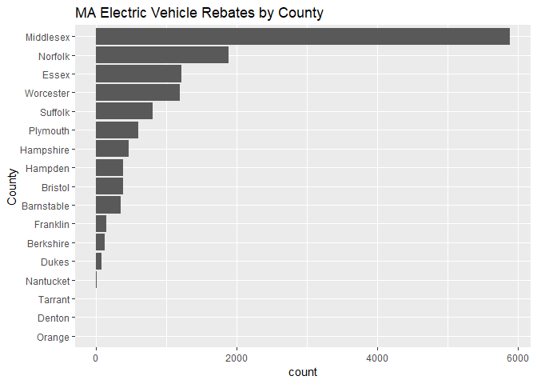

Analysis of MOR-EV data
================
February 2019

#### By Erica Yee / Bostonography

For my tabular data assignment I used a data set from the [Massachusetts
Offeres Rebates for Electric Vehicles](https://mor-ev.org) program. I
retrieved the data set as a Google Sheet directly from the website, then
downloaded it as a csv. Some of the rebates listed in this data were
distributed to Boston zip codes.

``` r
# load the tidyverse libraries
require(tidyverse)

# read the csv file into a new data frame (tibble)
# I had to format the csv slightly, such as standardizing the date and currency columns.
ev_data <- read_csv("data/MOR-EV_data.csv")

# print the data set to get a sense what it contains.
head(ev_data)
```

    ## # A tibble: 6 x 13
    ##   `Application Nu~ `Total Amount` `Total Number` `Application Re~
    ##   <chr>            <chr>                   <dbl> <chr>           
    ## 1 M-000011         $2,500                   2500 6/19/14 13:57   
    ## 2 M-000013         $1,500                   1500 6/20/14 16:34   
    ## 3 M-000014         $2,500                   2500 6/20/14 19:26   
    ## 4 M-000015         $1,500                   1500 6/20/14 20:58   
    ## 5 M-000016         $2,500                   2500 6/21/14 20:48   
    ## 6 M-000017         $2,500                   2500 6/23/14 8:44    
    ## # ... with 9 more variables: `Application Approved Date` <chr>, `Vehicle
    ## #   Category` <chr>, `Vehicle Model` <chr>, `Vehicle Make` <chr>, `Vehicle
    ## #   Year` <dbl>, `Date of Purchase` <date>, `Purchase or Lease?` <chr>,
    ## #   `Zip Code` <dbl>, County <chr>

Now that we have the data, let’s create a histogram of the purchase date
of each vehicle that received a
rebate.

``` r
ev_data %>% ggplot() + aes(x=`Date of Purchase`) + geom_histogram() + labs(title = "Electric Vehicle Rebates Given in Massachusetts")
```

<!-- -->

The dataset gives the category of each vehicle with the following
legend. \* BEV: Battery Electric Vehicle (all electric) \* PHEV+:
Plug-in Hybrid Electric Vehicle with battery capacity \> 10kWh (powered
by electricity and gasoline) \* PHEV+: Plug-in Hybrid Electric Vehicle
with battery capacity \< 10kWh (powered by electricty and gasoline) \*
FCEV: Fuel Cell Electric Vehicle (hydrogen fuel cell) \* ZEM: Zero
Emission Motorcycle

We can see that the number of all electric vehicles has increased
significantly over the past few
years.

``` r
ev_data %>% ggplot() + aes(x = `Date of Purchase`, fill = `Vehicle Category`) + geom_histogram() + labs(title = "Electric Vehicle Rebates Given in MA by Category")
```

<!-- -->

Alternatively, we can create bar charts of leased vs. purchased vehicles
for each of these categories.

``` r
# add fills to bar charts
ev_data %>% ggplot() + aes(x = `Vehicle Category`, fill = `Purchase or Lease?`) + geom_bar() + coord_flip()  + labs(title = "MA Electric Vehicle Rebates by Category")
```

<!-- -->

``` r
# create relative bar charts (fill as a percentage of the whole) using position_fill
ev_data %>% ggplot() + aes(x = `Vehicle Category`, fill = `Purchase or Lease?`) + geom_bar(position = position_fill()) + coord_flip()   + labs(title = "MA Electric Vehicle Rebates by Category") + scale_y_continuous(labels = scales::percent)
```

<!-- -->

We can do the same comparisons for rebate
amount.

``` r
ev_data %>% ggplot() + aes(x = `Vehicle Category`, fill = `Total Amount`) + geom_bar() + coord_flip() + labs(title = "MA Electric Vehicle Rebates by Category")
```

<!-- -->

``` r
ev_data %>% ggplot() + aes(x = `Vehicle Category`, fill = `Total Amount`) + geom_bar(position = position_fill()) + coord_flip()  + labs(title = "MA Electric Vehicle Rebates by Category") + scale_y_continuous(labels = scales::percent)
```

<!-- -->

By charting the number of rebates per county, we see that Middlesex
received by far the
most.

``` r
ev_data %>% filter(County!= 'NA') %>% ggplot() + aes(fct_rev(fct_infreq(County))) + geom_bar() + coord_flip()  + labs(title = "MA Electric Vehicle Rebates by County", x = "County")
```

<!-- -->

There are way too many vehicle models (e.g., “Nissan Leaf SV”) to plot
nicely. The Tabelau visualization on the MOR-EV website gives counts by
retailer, but that data is unfortunately not in the spreadsheet. So I
made a new column in the csv file that extracted the vehicle make from
each model. Here’s that data by
itself.

``` r
ev_data %>% ggplot() + aes(fct_rev(fct_infreq(`Vehicle Make`))) + geom_bar() + coord_flip() + labs(title = "MA Electric Vehicle Rebates by Make", x = "Vehicle Make")
```

<!-- -->

Now we can do a lot more analysis of other dimensions of the data
compared to the vehicle
make.

``` r
ev_data %>% ggplot() + aes(x = `Date of Purchase`, fill = `Vehicle Make`) + geom_histogram() + labs(title = "MA Electric Vehicle Rebates by Make and Purchase Year")
```

<!-- -->

``` r
ev_data %>% ggplot() + aes(x = `Vehicle Year`, fill = `Vehicle Make`) + geom_histogram() + labs(title = "MA Electric Vehicle Rebates by Vehicle Make and Year")
```

<!-- -->

``` r
ev_data %>% ggplot() + aes(fct_rev(fct_infreq(`Vehicle Make`)), fill = `Vehicle Category`) + geom_bar() + coord_flip()  + labs(title = "MA Electric Vehicle Rebates by Make and Category", x = "Vehicle Make")
```

<!-- -->

``` r
ev_data %>% ggplot() + aes(fct_rev(fct_infreq(`Vehicle Make`)), fill = `Vehicle Category`) + geom_bar(position = position_fill()) + coord_flip()  + labs(title = "MA Electric Vehicle Rebates by Make and Category", x = "Vehicle Make") + scale_y_continuous(labels = scales::percent)
```

<!-- -->

We can also facet the data by make. The sheer proportion of Teslas blows
almsot all the other retailers off the map.

``` r
# faceting allows you to divide a variable into different plots
ev_data %>% ggplot() + aes(x = `Date of Purchase`) + geom_histogram() + facet_wrap(~`Vehicle Make`)  + labs(title = "MA Electric Vehicle Rebates by Make and Purchase Year")
```

<!-- -->

I also wanted to look at how many total rebate dollars have been given
out. To do this, I had to add a new column in the csv next to ‘Total
Amount’ that had the same values but in number format instead of
currency. I then used the plyr library to do summary statistics, then
ggplot again to chart the total amounts.

``` r
require(plyr)
cat_amounts <- ddply(ev_data, .(`Vehicle Category`), summarize, total = sum(`Total Number`))
make_amounts <- ddply(ev_data, .(`Vehicle Make`), summarize, total = sum(`Total Number`))

cat_amounts %>% ggplot() + aes(reorder(`Vehicle Category`, total), y = total) + geom_bar(stat = 'identity') + coord_flip() + labs(title="Total Rebate Amount Given out in MA Electric Vehicle Rebates by Category", x= "Vehicle Make", y="Total ($)") + scale_y_continuous(labels = scales::comma)
```

<!-- -->

``` r
make_amounts %>% ggplot() + aes(reorder(`Vehicle Make`, total), y = total) + geom_bar(stat = 'identity') + coord_flip() + labs(title="Total Rebate Amount Given out in MA Electric Vehicle Rebates by Make", x = "Vehicle Make", y="Total ($)") + scale_y_continuous(labels = scales::comma)
```

<!-- -->

Lastly, I charted multi-dimensional data of vehicle make and category
over purchase date to give a final overview of the
data.

``` r
ev_data %>% ggplot() + aes(x = `Date of Purchase`, y = `Vehicle Make`, color = `Vehicle Category`) + 
  geom_point(alpha = 0.4) + labs(title = "MA Electric Vehicle Purchased that Received Rebates Over Time")
```

<!-- -->
