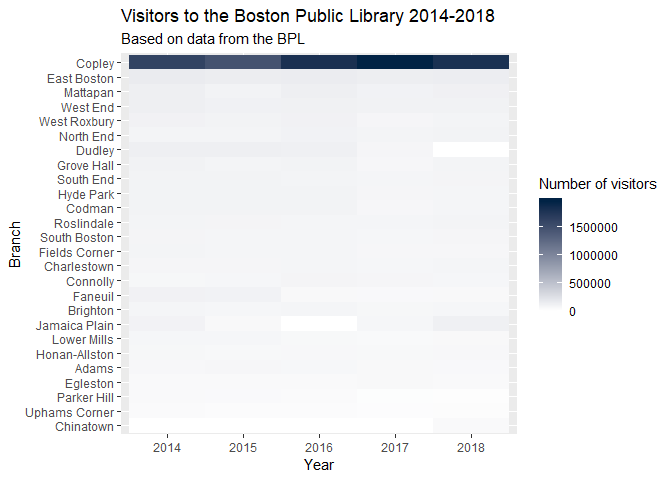
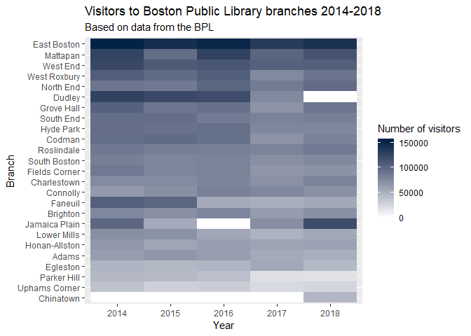
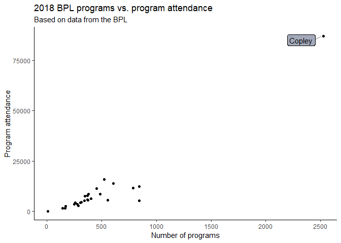
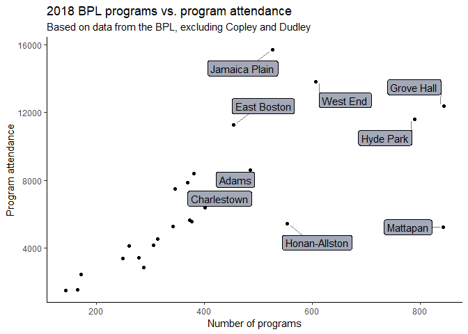
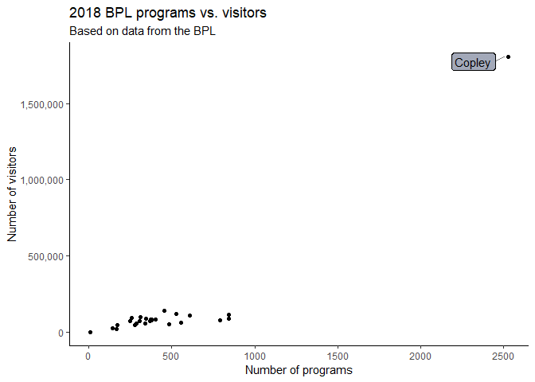
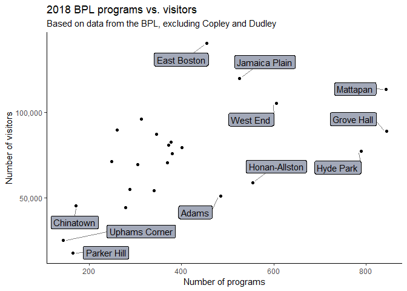

Exploratory Analysis of Boston Public Library Data
================
April 2019

#### By Erica Yee / Bostonography

Here are some visualizations I created as part of a project for my
Spring 2019 Bostonography course.

## Data background

The metrics tracked by the Boston Public Library (BPL) tell us what the
library cares about. On its website, the BPL offers PDFs of [quarterly
data](https://www.bpl.org/about-us/statistics/) on the number of
programs, program attendance, visitors, circulation, wireless sessions,
and computer sessions broken down per branch. I focused on the visitors,
programs, and program attendance metrics in this dataset for a
high-level overview of the library branches.

## Library visitors

I almost immediately ran into the issue of the Central Library in Copley
Square as an outlier because of its vast number of visitors and
offerings. In 2018, Copley had 1,808,200 visitors, while all the other
branches combined had 1,804,151. This disparity makes sense because
Copley is the central branch and a tourist destination, and therefore
serves the entire city. I decided to create dual versions of each graph,
with and without Copley. It is valuable to visually see how many more
visitors, programs, and program attendees Copley has than the branches,
but I can make more nuanced comparisons by just comparing the branches.

In the heatmap of visitors to branches from the last five years, there
are a few other anomalies in the white boxes, which mean the branches
had no visitors that year: The Dudley branch is under renovation through
2020 and thus was closed in 2018, Jamaica Plain was under renovation in
2016, and Chinatown opened in 2018. According to the data, East Boston
sees more visitors overall than any other branch, and Uphams Corner had
the least excluding the newly opened Chinatown branch.

``` r
library(tidyverse)

# read data
visitors <- read_csv("data/bpl_visitors14-18.csv")
programs <- read_csv("data/bpl_programs14-18.csv")
attendance <- read_csv("data/bpl_attendance14-18.csv")

# convert the data from wide to long
visitors$Location <- factor(visitors$Location)
v_long <- gather(visitors, year, vis, '2014':'2018', factor_key=TRUE)

v_branches <- visitors %>% filter(Location != 'Copley')
v_branches$Location <- factor(v_branches$Location)
v_branches_long <- gather(v_branches, year, vis, '2014':'2018', factor_key=TRUE)

# with copley
v_long %>% ggplot() + geom_tile() + 
  aes(x=year, y=reorder(Location, vis), fill=vis) + 
  scale_fill_gradient(low="#FFFFFF", high="#012345") + 
  labs(fill="Number of visitors", 
       title="Visitors to the Boston Public Library 2014-2018",
       subtitle="Based on data from the BPL", 
       x="Year", 
       y="Branch")
```

<!-- -->

``` r
# just branches
v_branches_long %>% ggplot() + geom_tile() + 
  aes(x=year, y=reorder(Location, vis), fill=vis) + 
  scale_fill_gradient(low="#FFFFFF", high="#012345") +
  labs(fill="Number of visitors", 
       title="Visitors to Boston Public Library branches 2014-2018", 
       subtitle="Based on data from the BPL", 
       x="Year", 
       y="Branch")
```

<!-- -->

## Programs vs. program attendance

Next, I plotted number of programs offered by each branch in 2018 to
overall program attendance. Most branches seem to be generally
proportionate, i.e., the more programs it has compared to other
branches, the greater its program attendance.

``` r
library(ggrepel)

# combine data from separate dataframes
prog_renamed <- programs %>% rename(p2018='2018') %>% rename(p2017='2017') %>% rename(p2016='2016') %>% rename(p2015='2015') %>% rename(p2014='2014')

att_renamed <- attendance %>% rename(a2018='2018') %>% rename(a2017='2017') %>% rename(a2016='2016') %>% rename(a2015='2015') %>% rename(a2014='2014')

prog_att <- bind_cols(prog_renamed, att_renamed)

# plot with Copley
prog_att %>% ggplot() + aes(x=p2018, y=a2018) + geom_point() + 
  geom_label_repel(aes(label=ifelse(p2018>2000,Location,'')),
                  box.padding   = 0.35, 
                  point.padding = 0.5,
                  segment.color = 'grey50',
                  fill = '#A3A9B9') +
  theme_classic() + 
  labs(title="2018 BPL programs vs. program attendance", 
       subtitle="Based on data from the BPL", 
       x="Number of programs", 
       y="Program attendance")
```

<!-- -->

``` r
# just branches
prog_att %>% filter(Location!='Copley') %>% filter(Location!='Dudley') %>% ggplot() + aes(x=p2018, y=a2018) + geom_point() + 
  geom_label_repel(aes(label=ifelse(p2018>400,Location,'')),
                  box.padding   = 0.35, 
                  point.padding = 0.5,
                  segment.color = 'grey50',
                  fill = '#A3A9B9') +
  theme_classic() + 
  labs(title="2018 BPL programs vs. program attendance", 
       subtitle="Based on data from the BPL, excluding Copley and Dudley", 
       x="Number of programs", 
       y="Program attendance")
```

<!-- -->

However, the Mattapan branch had an unusually high number of programs
with relatively low attendance. Looking back at the branch visitors
heatmap, Mattapan has the second most visitors overall (though third in
2018 behind East Boston and Jamaica Plain). This branch clearly has a
lot of patrons. But without further context about Mattapan’s goals and
patrons, I can only speculate about the seeming discrepancy. Perhaps the
branch tried out many new programs in 2018 to see what engaged its
community. Conversely, Jamaica Plain had the highest program attendance
in 2018, but the sixth most number of programs. From the heatmap, we see
that the branch had an uncommonly high number of visitors in 2018. It
would follow then that program attendance was high.

``` r
# combine data
vis_renamed <- visitors %>% rename(v2018='2018') %>% rename(v2017='2017') %>% rename(v2016='2016') %>% rename(v2015='2015') %>% rename(v2014='2014')

prog_vis <- bind_cols(prog_renamed, vis_renamed)

# with copley
prog_vis %>% ggplot() + aes(x=p2018, y=v2018) + geom_point() + scale_y_continuous(labels = scales::comma) + 
  geom_label_repel(aes(label=ifelse(p2018>2000,Location,'')),
                  box.padding   = 0.35, 
                  point.padding = 0.5,
                  segment.color = 'grey50',
                  fill = '#A3A9B9') +
  theme_classic() + 
  labs(title="2018 BPL programs vs. visitors", 
       subtitle="Based on data from the BPL", 
       x="Number of programs", 
       y="Number of visitors")
```

<!-- -->

``` r
# just branches
prog_vis %>%  filter(Location!='Copley') %>% filter(Location!='Dudley') %>% ggplot() + aes(x=p2018, y=v2018) + geom_point() + scale_y_continuous(labels = scales::comma) + 
  geom_label_repel(aes(label=ifelse(p2018>450 | p2018<200,Location,'')),
                  box.padding   = 0.35, 
                  point.padding = 0.5,
                  segment.color = 'grey50',
                  fill = '#A3A9B9') +
  theme_classic() + 
  labs(title="2018 BPL programs vs. visitors", 
       subtitle="Based on data from the BPL, excluding Copley and Dudley", 
       x="Number of programs", 
       y="Number of visitors")
```

<!-- -->

The last comparison I performed on data from the library was between
number of programs and visitors in 2018. These points were generally
less correlated than programs vs. program attendance. The spread of
number of programs, from Uphams Corner (143) to Mattapan (843) and Grove
Hall (844), leads to several questions about how library programs come
about: How much control do branch libraries have over the programs they
offer? Are they mandated to offer a certain number annually based on
number of visitors or their budget? Should branches with high number of
visitors but more moderate number of programs, like East Boston, offer
more? Would offering more programs increase number of visitors? I don’t
have answers to these questions, which go beyond the scope of this data
analysis project. I also don’t pretend to know more how the library
system works and community needs than the libraries themselves. But
exploring the data from an external vantage point does provide some
thought-provoking findings.
